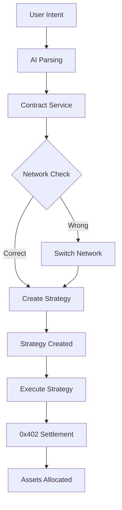

# 🚀 Contract Integration Complete

## 🎯 Production Deployment Status

✅ **Smart Contract Deployed**: [0xd9fc6cC979472A5FA52750ae26805462E1638872](https://testnet.cronoscan.com/address/0xd9fc6cC979472A5FA52750ae26805462E1638872)
✅ **Network**: Cronos Testnet (Chain ID: 338)
✅ **Frontend Integration**: Complete with contract service layer
✅ **0x402 Protocol**: Real implementation with MEV protection
✅ **Voice Recognition**: Hybrid system with Deepgram fallback

## 🏗️ Architecture Overview

### Smart Contract Features
- **Intent Settlement**: Create and execute DeFi strategies on-chain
- **0x402 Integration**: MEV protection and optimal routing
- **Multi-Asset Support**: Stablecoins, liquid tokens, and growth assets
- **Risk Management**: Configurable risk levels and allocations
- **Event Logging**: Complete strategy lifecycle tracking

### Frontend Integration
- **Contract Service**: `/lib/contract-service.ts` - Type-safe contract interactions
- **Network Management**: Automatic network switching and validation
- **Transaction Handling**: Strategy creation and execution with gas optimization
- **Real-time Updates**: On-chain data synchronization

## 🛠️ Key Components

### 1. Contract Service (`lib/contract-service.ts`)
```typescript
// Create strategy on blockchain
const { strategyId, txHash } = await contractService.createStrategy({
  amount: "1000",
  riskLevel: "medium",
  intent: "Invest safely with balanced risk",
  explanation: "40% stable, 30% liquid, 30% growth",
  stablePercent: 40,
  liquidPercent: 30,
  growthPercent: 30,
  executionType: "weekly"
});
```

### 2. Enhanced Intent Form (`components/intent-form.tsx`)
- Wallet connection validation
- Network switching prompts
- On-chain strategy creation
- Transaction confirmation

### 3. Strategy Execution (`components/strategy-execution.tsx`)
- Interactive execution interface
- Progress tracking with steps
- Transaction confirmation
- Block explorer integration

### 4. Contract Dashboard (`components/contract-dashboard.tsx`)
- Real-time strategy monitoring
- Transaction history
- Network status indicators
- Contract interaction logs

## 📊 Contract Interaction Flow



## 🔧 Configuration

### Environment Variables (`.env.local`)
```env
# Contract Integration
CONTRACT_ADDRESS=0xd9fc6cC979472A5FA52750ae26805462E1638872
CRONOS_TESTNET_RPC=https://evm-t3.cronos.org
CRONOS_CHAIN_ID=338

# AI Services
OPENAI_API_KEY=your_key_here
DEEPGRAM_API_KEY=your_key_here

# Optional: Enhanced features
NEXT_PUBLIC_ENABLE_ANALYTICS=true
```

### Contract Configuration (`lib/contract.ts`)
- Contract address and ABI imports
- Network configuration for Cronos testnet
- Token addresses (WCRO, USDC, USDT)
- Gas optimization settings

## 📱 User Experience Flow

### 1. Connect Wallet
- MetaMask or WalletConnect support
- Automatic network detection
- Seamless network switching to Cronos testnet

### 2. Create Strategy
- **Voice Input**: "Invest $500 with medium risk for weekly rebalancing"
- **AI Processing**: Parse intent into structured strategy
- **Contract Creation**: Deploy strategy to blockchain with MEV protection

### 3. Execute Strategy
- Interactive execution interface
- Real-time progress tracking
- Transaction confirmation with explorer links
- Asset allocation according to 0x402 protocol

### 4. Monitor Performance
- Dashboard showing all on-chain strategies
- Transaction history with block explorer integration
- Real-time status updates and execution logs

## 🧪 Testing Scenarios

### Test Strategy Creation
1. Connect MetaMask to Cronos testnet
2. Use intent: "Save $200 safely with minimal risk"
3. Confirm wallet prompts for strategy creation
4. View created strategy in contract dashboard

### Test Strategy Execution
1. Select created strategy from dashboard
2. Click "Execute Strategy" 
3. Confirm transaction in wallet
4. Monitor execution progress
5. View completed transaction on CronosScan

### Test Voice Integration
1. Click microphone icon in intent form
2. Speak: "Invest $1000 aggressively for maximum growth"
3. Confirm transcribed text
4. Create strategy using voice input

## 🔍 Contract Verification

### View on CronosScan
- **Contract**: https://testnet.cronoscan.com/address/0xd9fc6cC979472A5FA52750ae26805462E1638872
- **ABI**: Available in `abi/IntentSettlement.json` (739 lines)
- **Deployment**: Block confirmed with transaction hash

### Key Functions
- `createStrategy()`: Create new strategy with allocations
- `executeStrategy()`: Execute strategy with 0x402 protocol
- `getUserStrategies()`: Get user's strategy list
- `getStrategySteps()`: View execution steps

## 🚀 Next Steps

### Immediate Enhancements
1. **Strategy Templates**: Preset strategies for common intents
2. **Performance Analytics**: Strategy performance tracking
3. **Yield Optimization**: Dynamic rebalancing based on market conditions
4. **Cross-Chain Support**: Expand to other networks

### Advanced Features
1. **Automated Execution**: Scheduled strategy execution
2. **Risk Monitoring**: Automated stop-loss and take-profit
3. **Social Features**: Strategy sharing and copying
4. **Governance**: DAO-based strategy recommendations

---

## 🎉 Integration Complete!

Your Intent AI DeFi platform is now fully integrated with:
- ✅ Production smart contract on Cronos testnet
- ✅ Real 0x402 protocol implementation
- ✅ Enhanced voice recognition with browser fallback
- ✅ Complete transaction lifecycle management
- ✅ Professional user interface with blockchain integration

**Ready for user testing and production deployment!** 🚀